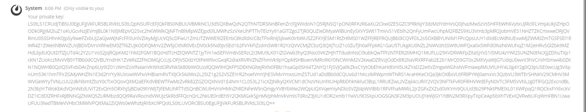
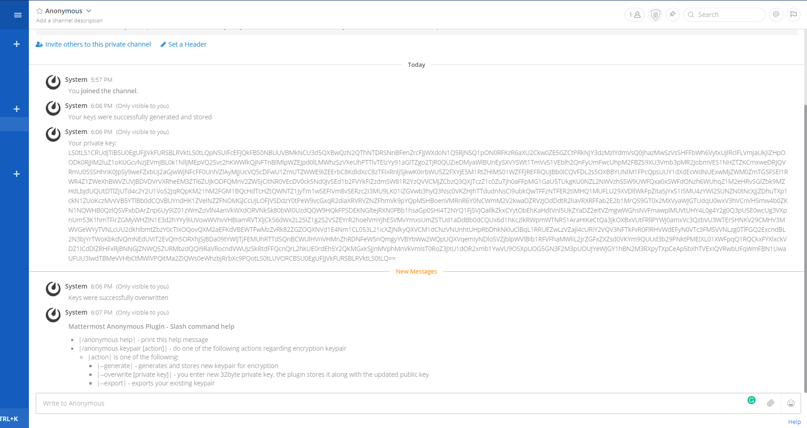
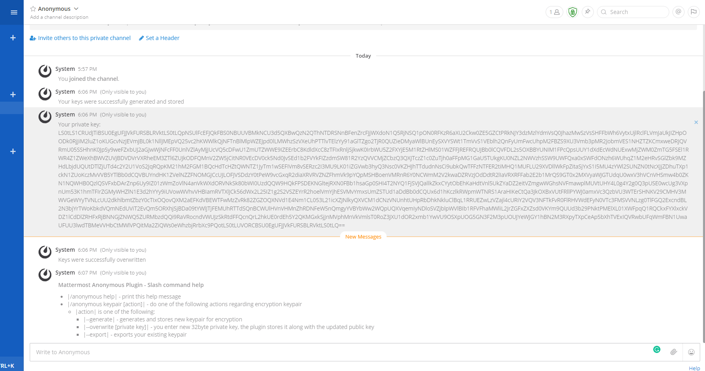

# Anonymous Plugin 
[](https://circleci.com/gh/bakurits/mattermost-plugin-anonymous) 
[](https://codecov.io/gh/bakurits/mattermost-plugin-anonymous)

**Maintainer:** [@dbejanishvili](https://github.com/dbejanishvili)
**Co-Maintainers:** [@bakurits](https://github.com/bakurits) [@Gvantsats](https://github.com/Gvantsats)

An end to end encryption plugin for Mattermost. Enables user side encryption for messages sent over private and public channels.
To learn more about Mattermost plugins, see [Mattermost plugin documentation](https://developers.mattermost.com/extend/plugins/).

## Table of Contents
- [License](#license)
- [System Admin Instructions](#for-mattermost-system-admins)
    - [Plugin Setup](#plugin-setup)
    - [Onboarding Your Users](#onboarding-your-users)
- [User Instructions](#for-users)
    - [Slash Commands](#slash-commands)
    - [Automatic Encryption](#automatic-encryption)
- [Developer/Contributor Instructions](#for-developers-and-contributors)
    - [Setting Up Environment](#setting-up-environment)
    - [Building And Deployment](#building-and-deployment)

## **License**

This repository is licensed under the [Apache 2.0 License](https://github.com/bakurits/mattermost-plugin-anonymous/blob/master/LICENSE).


## **For Mattermost System Admins**
### Plugin Setup
You can install the plugin from mattermost plugin marketplace, or follow the instructions given in [Building And Deployment](#building-and-deployment) section

### Onboarding Your Users
The encrypted messages will only be decrypted for users who have already generated their key pairs. Key pairs are channel specific, so the keys need to be generated for each channel that needs to support end to end encryption. Make sure that every user, who intends to use the encryption feature, has the keys set up.


## **For Users**
### Slash Commands
* __Autocomplete slash commands__ - Explore all the available slash commands by typing `/` in the text input box - the autocomplete suggestions help by providing a format example in black text and a short description of the slash command in grey text. To access slash commands for this plugin, type `/anonymous` and pass appropriate parameters. Visit the [executing commands](https://docs.mattermost.com/help/messaging/executing-commands.html) documentation for more details.
* __Generate key pair__ - use `/anonymous keypair --generate` to generate key pair for current channel. Key pair is necessary for the plugin to work properly. This command will generate private and public keys and store them accordingly. Public key is stored on the server, private key is stored in a local storage of the device which the user is currently using (for example in a specific browser, or in a Mattermost desktop application). Since the private key is stored on front-end, it needs to be redistributed between users other devices by hand using command for importing key pairs. On success the command should post following message

    

* __Overwrite key pair__ - use `/anonymous keypair --overwrite` to import a key pair to a new device. The key pair will overwrite the previous key pair, or , if such doesn't exist, add new. You don't need to provide both keys, cause public key can be calculated using the private key.  On success the command should post following message

    


* __Export key pair__ - use `/anonymous keypair --export` to get your existing private key, for purposes of importing it to a new device or any other. You don't need both keys, cause public key can be calculated using the private key, so only private key will be exported  On success the command should post similar message

    


* __Send encrypted message__ - use `/anonymous a` command, followed by a message, to send said message in encrypted form, regardless if the automatic encryption is currently on or off. This is a quick way of sending encrypted message without needing to toggle automatic encryption on/off

* __Help!__ - use `/anonymous help` command, to see how to properly use slash commands

### Automatic Encryption
Plugin supports automatic encryption feature. There is a button at a top right corner of the screen, that indicates whether the automatic encryption is on or off. 

If it's grey the encryption is off, 


if it's green the encryption is on. 



You can toggle automatic encryption state by pressing said button. The encryption state of a channel-user pair is shared across all devices (so toggling it on your pc will also toggle it on your smartphone and vice versa).

When the automatic encryption is on, each of your messages will be sent in encrypted form.
(As of yet, turning encryption on doesn't generate key pair, when the key pair isn't present, so keep in mind to generate key pair before starting to use automatic encryption)


## **For Developers And Contributors**
### Setting Up Environment
Fork the repository to your own account and then clone it to a directory outside of `$GOPATH` matching your plugin name:
```
git clone https://github.com/owner/mattermost-plugin-anonymous
```

Note that this project uses [Go modules](https://github.com/golang/go/wiki/Modules). Be sure to locate the project outside of `$GOPATH`, or allow the use of Go modules within your `$GOPATH` with an `export GO111MODULE=on`.

### Building And Deployment
To build your plugin use `make`

Use `make check-style` to check the style.

Use `make debug-dist` and `make debug-deploy` in place of `make dist` and `make deploy` to configure webpack to generate unminified Javascript.

`make` will produce a single plugin file (with support for multiple architectures) for upload to your Mattermost server:

```
dist/com.example.my-plugin.tar.gz
```

Alternatively you can deploy a plugin automatically to your server, but it requires login credentials:
```
export MM_SERVICESETTINGS_SITEURL=http://localhost:8065
export MM_ADMIN_USERNAME=admin
export MM_ADMIN_PASSWORD=password
make deploy
```

or configuration of a [personal access token](https://docs.mattermost.com/developer/personal-access-tokens.html):
```
export MM_SERVICESETTINGS_SITEURL=http://localhost:8065
export MM_ADMIN_TOKEN=j44acwd8obn78cdcx7koid4jkr
make deploy
```

In production, deploy and upload your plugin via the [System Console](https://about.mattermost.com/default-plugin-uploads).


 